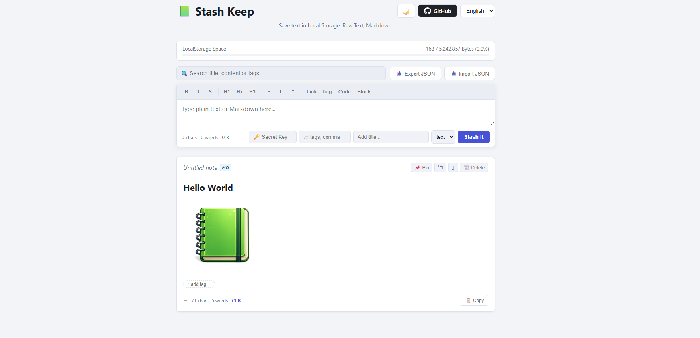

# 📗 Stash Keep

A lightweight, browser-based note-taking application designed for saving plain text and Markdown snippets locally.

## 🚀 Overview

Stash Keep allows you to store information directly in your browser. All data is managed using **IndexedDB**, offering high storage capacity and ensuring that your notes remain private and stored only on your device.

## ✨ Key Features

- **Markdown Support:** Write and preview formatted text with a built-in Markdown editor.
- **Local Encryption:** Secure sensitive notes with optional AES-GCM encryption.
- **Organization:** Pin important notes and categorize items using a tagging system.
- **Offline Access:** Works offline via Service Worker support.
- **Data Management:** Export and import your entire collection as JSON for backups.
- **Privacy Focused:** No external servers or accounts required; your data stays in your browser.

## 🌐 Website
[https://sweetforest.github.io/StashKeep/](https://sweetforest.github.io/StashKeep/)

---

## 🖼 Preview

